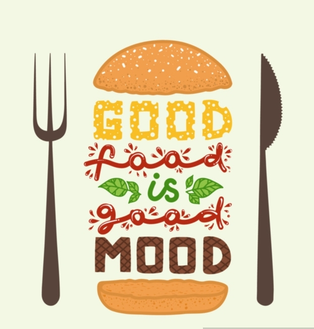

# Project 1

Restaurants on Rails
--------------------------------------


*Restaurants on Rails* is the new age Restaurant Finder. It helps you find the answer to the most difficult question: ***Where and What should I eat?***

Most of you must have figured out the mystery behind the name of this Application. It's obvious because it has been built majorly using ```Rails``` and hence ***Users*** can look for their loved *Restaurant on Rails*.

Any one who knows how to browse on the internet can use our service to find their favourite food place. Just search for the ***Cuisine*** you are craving for and we present you with a list of ***Restaurants*** that offers that particular Cuisine.

[Click here to find out your favourite food place!](https://rashidabengali.github.io/tic-tac-toe/)

---------------------------------------
## Membership Types

There are two types of Membership *Standard* & *Platinum*.


#### Standard Membership
*Standard* Users can create an account with us for absolutely **FREE** and they get the facility to *Comment*, ***Like*** and ***Review*** the Restaurants on our Page that will help them as well as other people make better dine in choices.


**Note**: Any one can see the list of Restaurants and its Reviews posted by others. However, only Members can Like or add a Review on a particular Restaurant's page.


#### Platinum Membership
*Platinum* Users can create an account with us for a mere amount of $20 and they get all the facilities of a Standard Member as well as are entitled to a BOOM BOOM 20% ***Discount*** on all the Restaurants listed on our page.

---------------------------------------
## Membership Rules

You really need to be ***Hungry*** to either ***Sign Up*** or ***Sign In***


----------------------------------------
Let's Begin
________________________________________

Cuisines
------------------------------------------

Simply search for your special **Cuisine** and satisfy your craving.


Each Cuisine will present you with a list of **Restaurants** that specialize in it.


Restaurants
------------------------------------------
You can find the following information on the ***Restaurant*** page that will help you make the best choice:

- Treat to the Eye: Food ***Photos*** that will give you a visual demonstration of how the dishes will look like when served
- ***Cuisine*** Type
- ***Location*** of the Restaurant
- Signature Dish
- ***Contact*** number to book a table in advance
- Average ***Rating*** and Number of ***Likes*** that will show the popularity of the Restaurant
- Chance to go through all the ***Comments*** posted by people who have already tried the restaurant out


#### Alternatively
----------------------------------------------
You can also search for the *Restaurants* directly from our list. The list shows the basic data like location and average rating of each Restaurant and in order to know more details for each, *Users* needs to click on it.


The Restaurants are listed in the order of the number of ***Likes***. The one with highest number of likes will always render at the top of the page so that the ***Users*** can make choices based on the popularity if they prefer.


Technical Terms
-----------------------------------------
Now, let's have a real conversation!

***Restaurants on Rails*** has the following MVC (Model View Controller) Structure:

- Cuisines
- Restaurants
- Reviews
- Likes
- Users

This application has individual ```.erb files``` **HTML** pages for each **Model's** *Index*, *Show*, *Edit* and *New* **Views**. The methods are well defined in the **Controller** files creating an ```instance variable``` for each method in order for it to have access in the View Page and be able to render data on the screen.

There is a vigorous use of **CSS** with a blend of attractive colours and plenty of hover effects. Each page has its own customized styling.

There is a minimal amount of **Javascript** applied to enhance some CSS features.

Major Features:
----------------------------------------

`chooseLevel()`
- Player can choose the *Game Level* and the *Type of Rounds* the player is interested in

`playGame()`
- Gets executed when **3x3** board boxes are clicked for either *Single Round* or *Tournament* and the results are rendered on the screen

`playGameHard()`
- Gets executed when **4x4** board boxes are clicked for either *Single Round* or *Tournament* and the results are rendered on the screen

`resetGame()`
- Player can hit the reset button to start a *New Game*

Acknowledgement
-------------------------------------------
- My *husband* who gave me hints to help me figure out the game logic
- ***Special thanks*** to *Yianni* & *Joel* for helping out with instant solutions every time I was stuck with a problem

Coming Soon
---------------------------------------------
* Player will be able to choose if he wants to play with the computer or with a friend online
* Player will get the facility to choose from a range of fancy icons


***Now, scroll up and click on the link and do the following:***

```
const enjoyGame = function () {
  alert('Fun Unlimited!');
};

enjoyGame();
```
