# Project 1

Restaurants on Rails
--------------------------------------
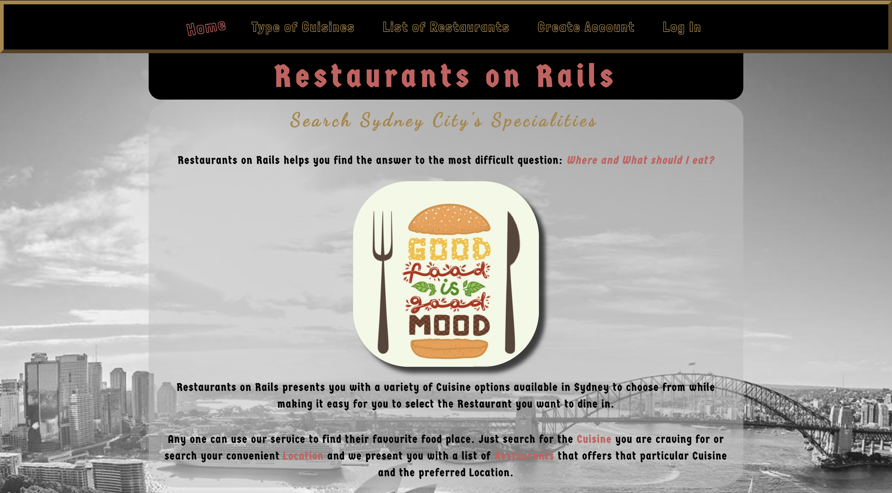

*Restaurants on Rails* is the new age Restaurant Finder. It helps you find the answer to the most difficult question: ***Where and What should I eat?***

Most of you must have figured out the mystery behind the name of this Application. It's obvious because it has been built majorly using ```Rails``` so ***Users*** can look for their loved *Restaurant on Rails*.

Any one who knows how to browse on the internet can use our service to find their favourite food place. Just search for the ***Cuisine*** you are craving for and we present you with a list of ***Restaurants*** that offer that particular Cuisine.

[Click here to find out your favourite food place!](https://project1-rashida.herokuapp.com/)

---------------------------------------
## Membership Types

There are two types of Membership *Standard* & *Platinum*.

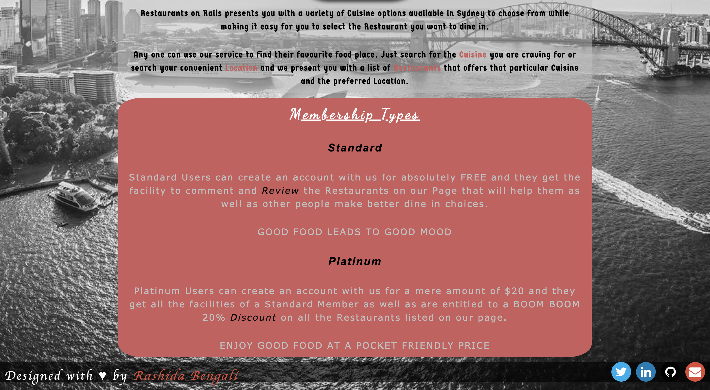

#### Standard Membership
*Standard* Users can create an account with us for absolutely **FREE** and they get the facility to *Comment*, ***Like*** and ***Review*** the Restaurants on our Page that will help them as well as other people make better dine in choices.

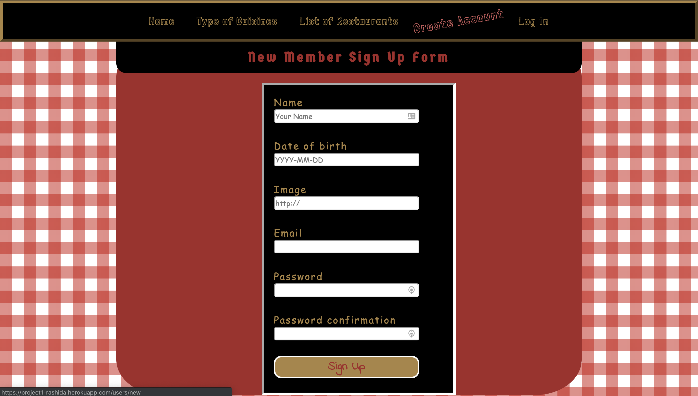

**Note**: Any one can see the list of Restaurants and its Reviews posted by others. However, only Members can Like or add a Review on a particular Restaurant's page.

#### Platinum Membership
*Platinum* Users can create an account with us for a mere amount of $20 and they get all the facilities of a Standard Member as well as are entitled to a BOOM BOOM 20% ***Discount*** on all the Restaurants listed on our page.

---------------------------------------
## Membership Rules

You really need to be ***Hungry*** to either ***Sign Up*** or ***Sign In***

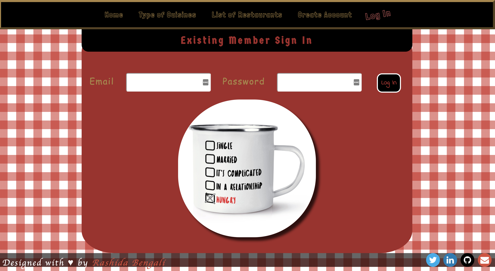

----------------------------------------
Let's Begin
________________________________________

Cuisines
------------------------------------------

Simply search for your special **Cuisine** and satisfy your craving.

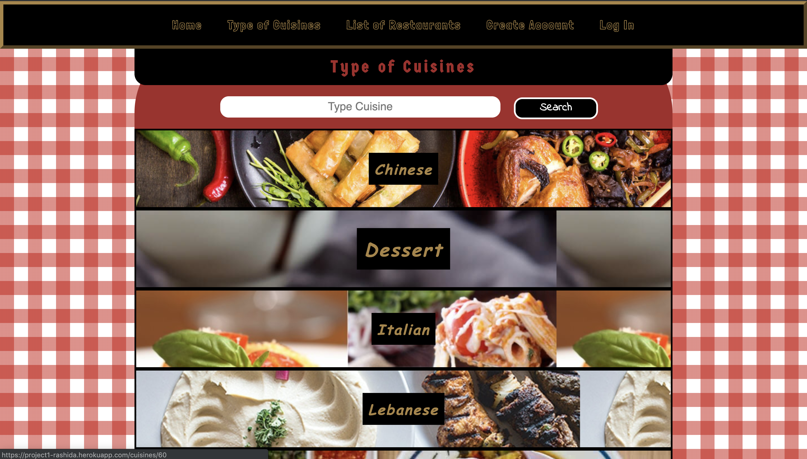

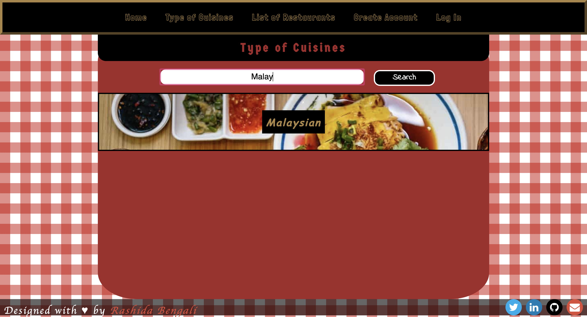

Each Cuisine will present you with a list of **Restaurants** that specialize in it.

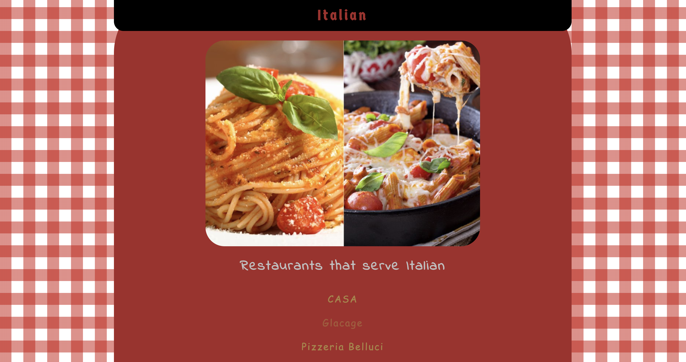

Restaurants
------------------------------------------
You can find the following information on a ***Restaurant*** page that will help you make the best choice:

- Treat to the Eye: Food ***Photos*** that will give you a visual demonstration of how tempting the dishes will look like when served
- ***Cuisine*** Type
- ***Location*** of the Restaurant
- Signature Dish
- ***Contact*** number to book a table in advance
- Average ***Rating*** and Number of ***Likes*** that will show the popularity of the Restaurant
- Chance to go through all the ***Comments*** posted by people who have already tried the restaurant out

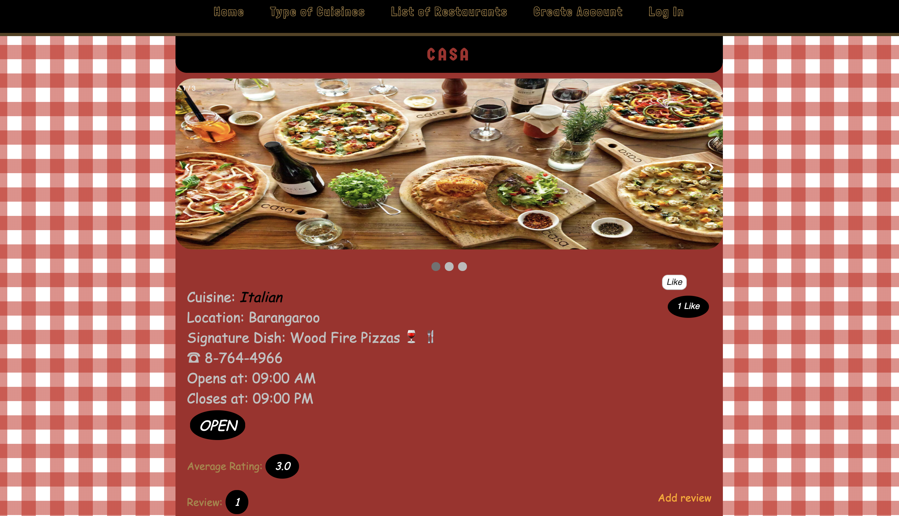

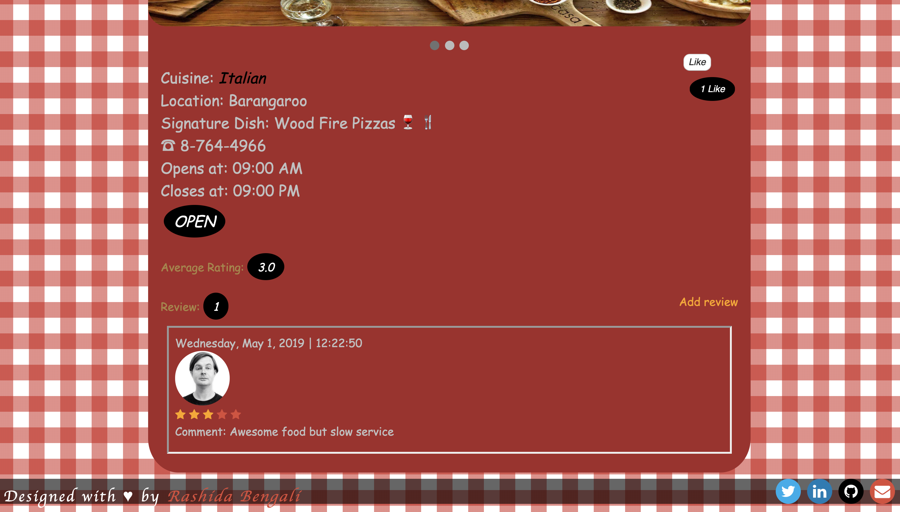

#### Alternatively
----------------------------------------------
You can also search for the *Restaurants* directly from our list. The list shows the basic information like *location* and average *rating* of each Restaurant and in order to know more details for each, *Users* needs to click on it.

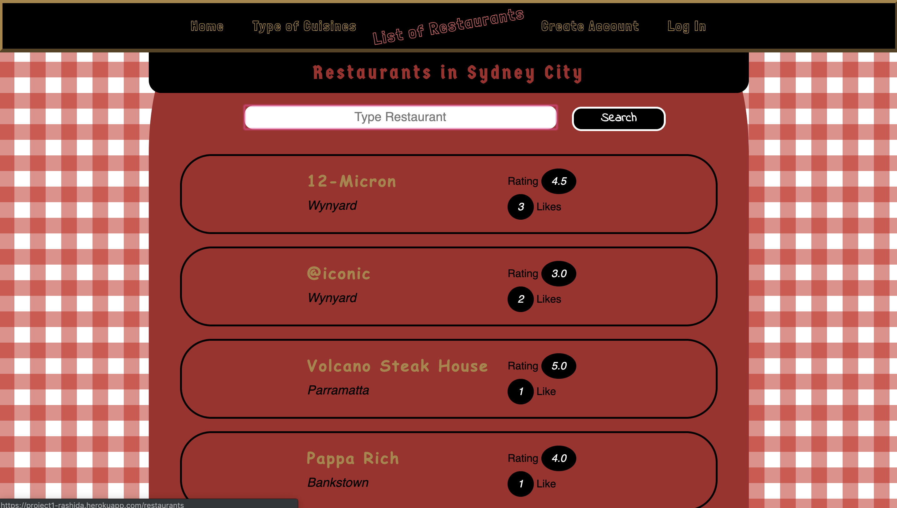

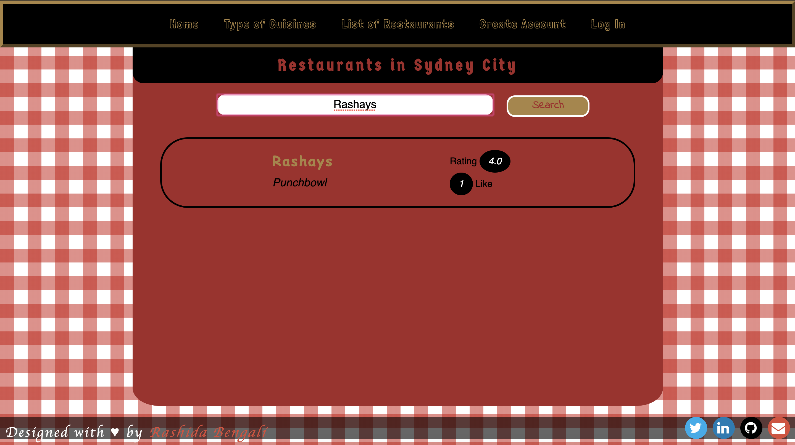

The Restaurants are listed in the order of the number of ***Likes***. The one with highest number of likes will always render at the top of the page so that the ***Users*** can make choices based on the popularity if they prefer.


Technical Terms
-----------------------------------------
Now, let's have a real conversation!

**PostgreSQL** database connection has been used for this Rails Application and has been deployed on **Heroku**.

***Restaurants on Rails*** has the following MVC (Model View Controller) Structure:

- Cuisines
- Restaurants
- Reviews
- Likes
- Users

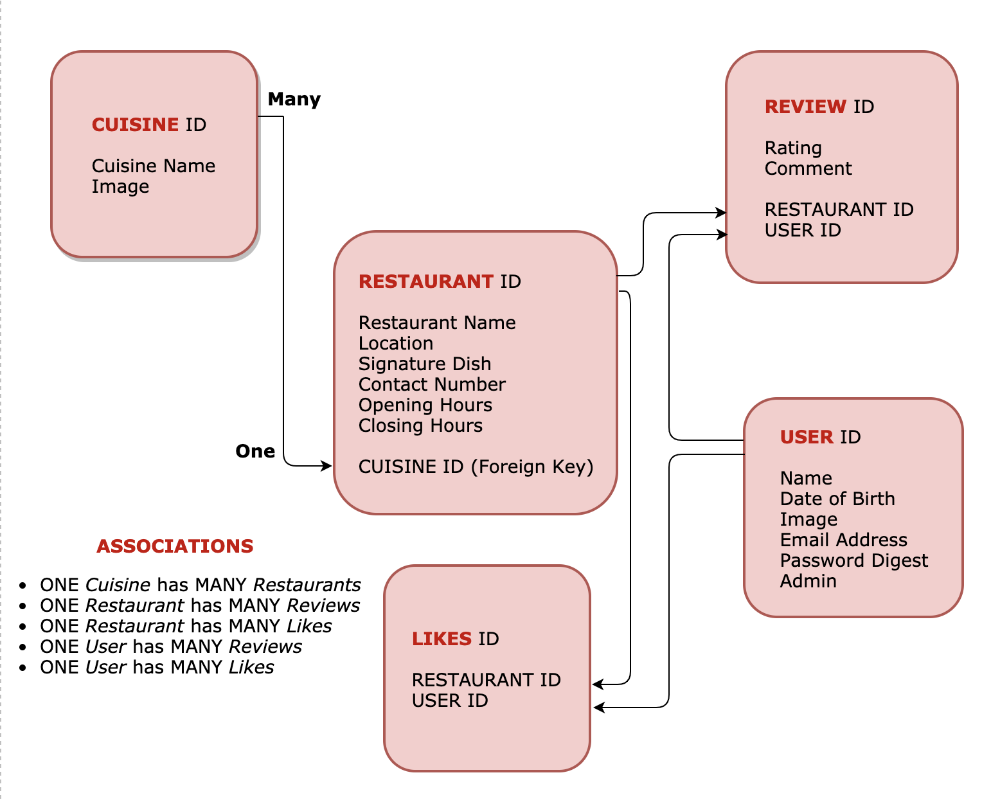

Each **Model** inherits from *ActiveRecord* that does the following in an object oriented fashion:
* Create tables
* Represent associations between Models
* Perform database operations.

All the controllers inherit from the *ApplicationController* that gives them all of its functionality.The ```methods``` are well defined in the **Controller** files creating an ```instance variable``` for each method in order for it to have access in the *View* Page and be able to render data on the screen.

This application has individual ```.erb files``` **HTML** pages for each *Model's* *Index*, *Show*, *Edit* and *New* **Views**.

There is a vigorous use of **CSS** with a blend of attractive colours and plenty of hover effects. Each page has its own customized styling.

There is a minimal amount of **Javascript** applied to enhance some CSS features.

Major Features:
----------------------------------------
`gem 'bcrypt'`
- This gem was installed to enable usage of secured passwords for **Users**.

Made effective use of `@current_user.present?` and `@current_user.admin?` to do the following:
1. Assigned **Admin** Rights for the Admin to be able to ***Add*** and ***Edit*** *Cuisines* or *Restaurants*. View profiles of All *Users*.
2. Only **Current User** has the Right to ***Edit*** his own comment but only ***View*** Rights for comments posted by others. Current User also has the rights to edit information ONLY in their profile.

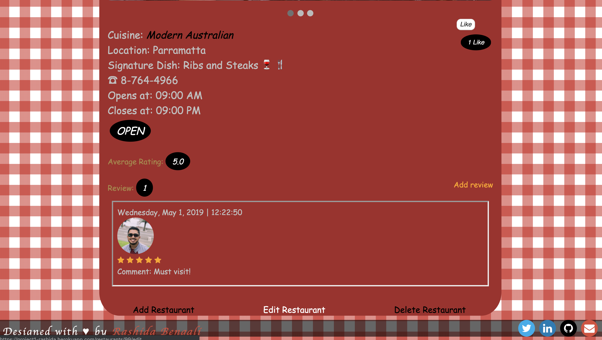

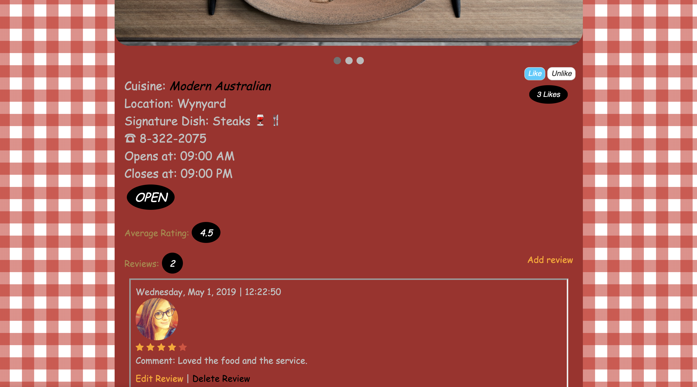

`gem 'ransack'`
- This gem was installed to create the **Search Bar** on the *Cuisines and Restaurants Index Pages*.

`Nested Resources`
- The **Reviews** and **Likes** `Routes` are nested inside the **Restaurants Routes**.

This enables the *User* to `Add Review` for that particular Restaurant without having to select it additionally. Since the User is clicking on *Add Review* from the *Restaurant Show Page*, the *Nested Routes* take the `Restaurant ID` along when directed towards `Review Form` so the Reviews get ***created*** and ***updated*** accordingly at the correct page.

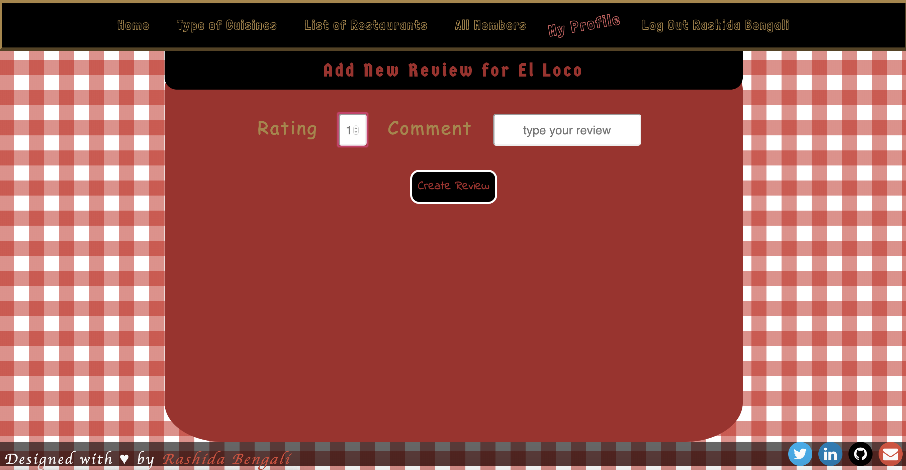

`.count method`
- Renders the total number of ***Likes*** and **Reviews** on the screen for each *Restaurant* by *Users*.

`.sort method`
- The Restaurants are listed in the order of the number of ***Likes***. The one with highest number of likes will always render at the top of the page so that the ***Users*** can make choices based on the popularity if they prefer.
- *Users* cannot *Like* one *Restaurant* MORE THAN ONCE.

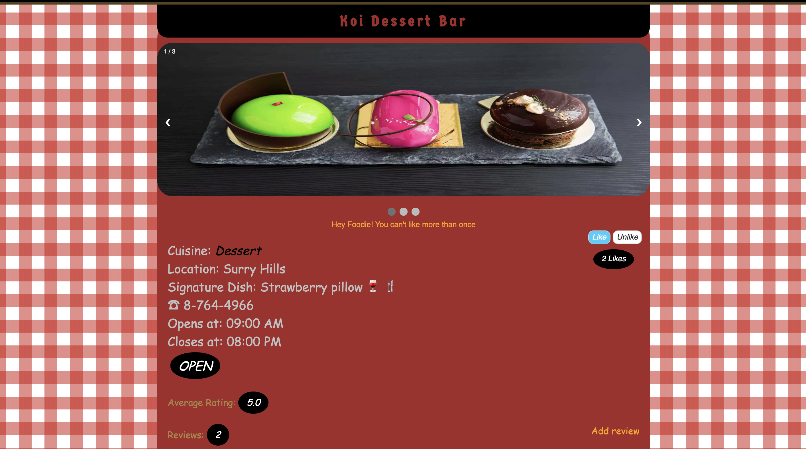

`average-rating`
- Both the *Index* and *Show* Pages show the average rating of each Restaurant based on the number of ratings they have got till now.

`Stars & Badges`
- Introduced *Star* Rating for *Reviews* & *Badges* to show the *Likes* and *Average-Rating*.

`Time.now method`
- Using this method with the `if else` condition to compare the ***opening*** and ***closing*** times of the *Restaurant* displays in real time whether the Restaurant is currently OPEN or CLOSED.

`.order(created_at: :desc)`
- This maintains the order of the **Reviews**, the latest being on top on being ***added***. Plus, the ones which get ***edited*** also maintain their original position rather than moving at the top.

`.created_at.strftime '%A, %B %e, %Y | %H:%M:%S'`
- Displays the date, day and time of the *Review* posted by the *User*.

Acknowledgement
-------------------------------------------
- This project would not have been possible without *Yianni's* and *Joel's* physical presence in the classroom or virtual presence on Slack. They assisted in every possible manner. I had planned out all the features that I wanted in my project but how to implement those were a challenge. Everytime, I started with either basic or big, I was stuck and it was them who took me out of the complicated loop and helped me with the results.

- I would also take the opportunity to show gratitude towards my Husband *Huzaifa* who was always there motivating me and building up my confidence.

Coming Soon
---------------------------------------------
* Build this application using Zomato API
* Add one more **Model** ***Locations*** so that ***Users*** can find ***Restaurants*** in their preferred Location.
* Introduce Platinum Membership in real time.
* Use Bootstrap to make CSS simpler.

***Now, scroll up and click on the link and find your favourite Restaurant:***
